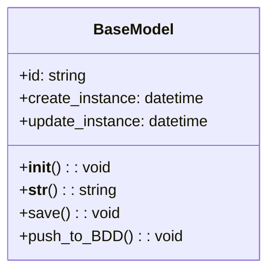
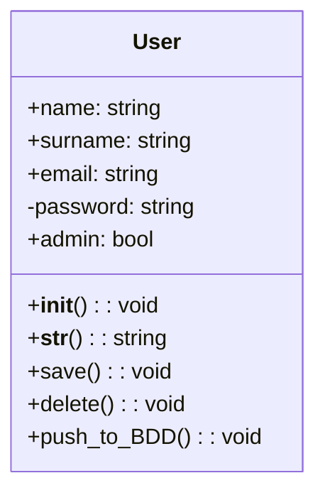
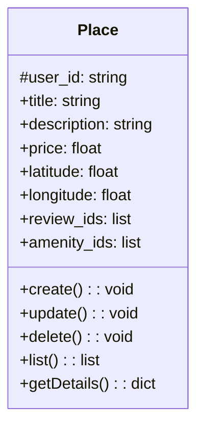
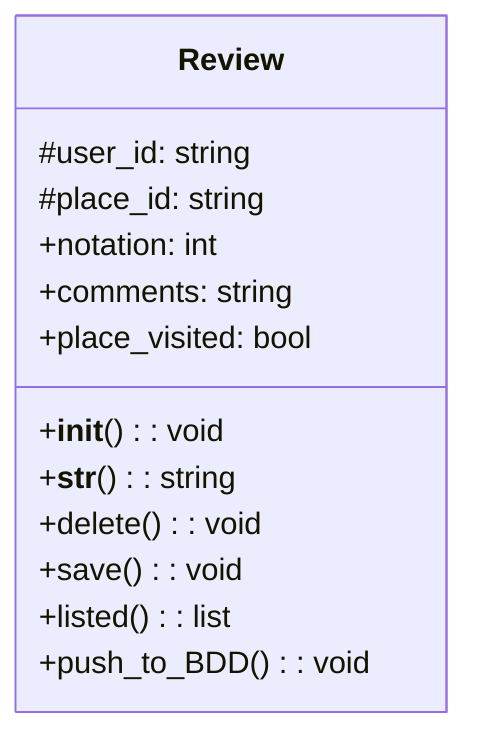
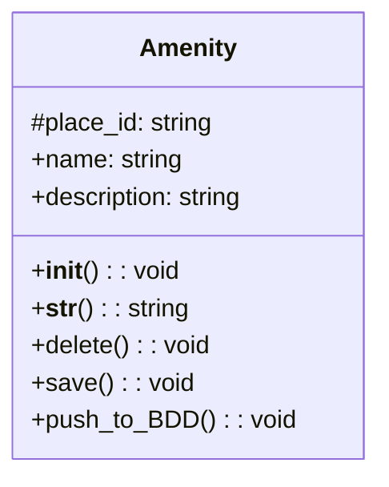

# 📦 Architecture – High-Level Class Diagram (Part 1 - Task 1)

## 🎯 Objectif

Ce diagramme de classes représente les principales entités métier de notre application **HBnB**, ainsi que leurs relations, leurs attributs et leurs méthodes.  
Il prolonge le diagramme de packages validé lors de la tâche 0 et sert de base à la conception des modèles métiers.

---

## 🧱 Structure générale

Nous avons identifié 4 entités principales :

- `User` : les utilisateurs de la plateforme
- `Place` : les logements proposés
- `Review` : les avis laissés par les utilisateurs
- `Amenity` : les services associés à un logement

Toutes ces entités héritent d’une super-classe commune : `BaseModel`.

---

## 🧩 Détail des classes

### 🟦 `BaseModel`

> Classe mère commune, contenant les attributs et méthodes partagés.

**Attributs :**

- `id : string` – identifiant unique
- `create_instance : datetime` – date de création
- `update_instance : datetime` – date de dernière modification

**Méthodes :**

- `__init__() : void`
- `__str__() : string`
- `save() : void`
- `push_to_BDD() : void`

---

### 🟩 `User` (hérite de `BaseModel`)

> Représente un utilisateur inscrit.

**Attributs :**

- `name : string`
- `surname : string`
- `email : string`
- `-password : string` *(champ protégé)*
- `admin : bool`

**Méthodes :**

- `__init__()`
- `__str__()`
- `save()`
- `delete()`
- `push_to_BDD()`

---

### 🟧 `Place` (hérite de `BaseModel`)

> Représente un bien mis en location.

**Attributs :**

- `#user_id : string`
- `title : string`
- `description : string`
- `price : float`
- `latitude : float`
- `longitude : float`
- `review_ids : list<string>`
- `amenity_ids : list<string>`

**Méthodes :**

- `create()`
- `update()`
- `delete()`
- `list() : list<Place>`
- `getDetails() : dict`

---

### 🟥 `Review` (hérite de `BaseModel`)

> Représente un avis rédigé par un utilisateur sur un logement.

**Attributs :**

- `#user_id : string`
- `#place_id : string`
- `notation : int`
- `comments : string`
- `place_visited : bool`

**Méthodes :**

- `__init__()`
- `__str__()`
- `delete()`
- `save()`
- `listed() : list<Review>`
- `push_to_BDD()`

---

### 🟪 `Amenity` (hérite de `BaseModel`)

> Représente un service proposé dans un logement.

**Attributs :**

- `#place_id : string`
- `name : string`
- `description : string`

**Méthodes :**

- `__init__()`
- `__str__()`
- `delete()`
- `save()`
- `push_to_BDD()`

---

## 🔗 Relations entre les entités

| Classe source | Relation | Classe cible | Description |
|---------------|----------|--------------|-------------|
| `User`        | 1 → *    | `Place`      | Un utilisateur peut proposer plusieurs lieux |
| `User`        | 1 → *    | `Review`     | Un utilisateur peut écrire plusieurs avis |
| `Place`       | 1 *→ *   | `Review`     | Un lieu peut recevoir plusieurs avis |
| `Place`       | 1 *→ *   | `Amenity`    | Un lieu peut proposer plusieurs services |

> 🔸 `*→*` représente une association forte (agrégation) : les entités liées sont interdépendantes.

---

## 🛠️ Choix de conception

- **Factorisation via `BaseModel`** pour centraliser la gestion des identifiants et des métadonnées.
- **Encapsulation** des liens (`user_id`, `place_id`) via des attributs protégés (`#`) pour favoriser la cohérence.
- **Relations multiples** gérées simplement via des listes d’identifiants (`review_ids`, `amenity_ids`).
- **Méthodes CRUD explicites** : chaque classe inclut des fonctions métier claires et alignées avec la logique de persistance.

---

## 🧭 Conclusion

Ce diagramme de classes formalise les bases de notre application HBnB avec une approche **orientée objet** cohérente et maintenable.  
Il servira de support direct à la rédaction des modèles métiers, à l’implémentation de l’API, et à la gestion des relations entre les entités.

