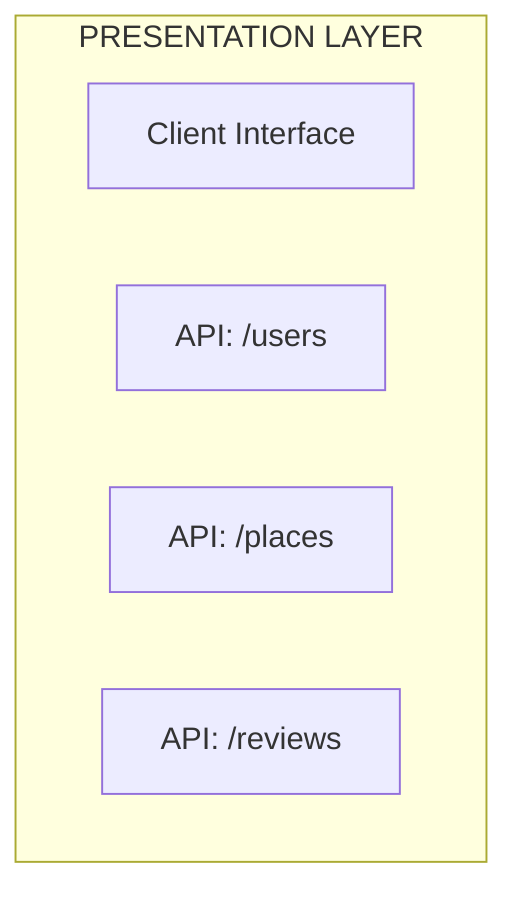
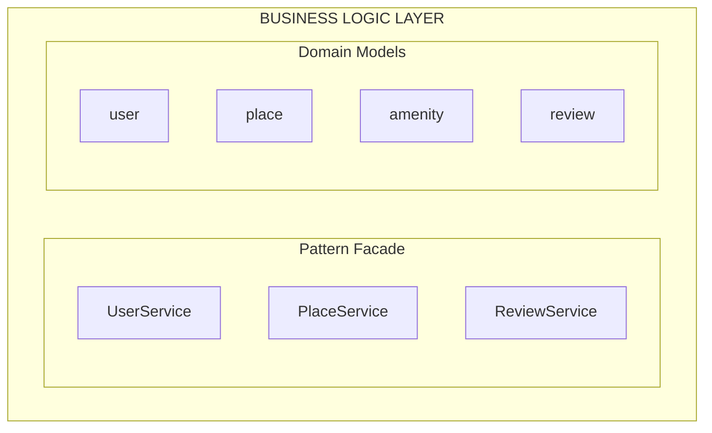
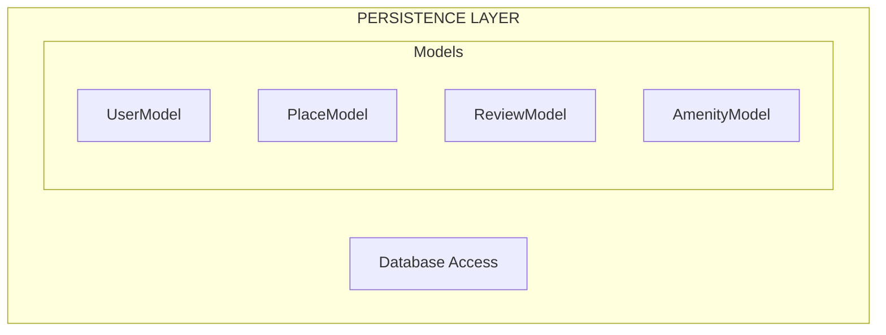

# 📦 Architecture – High-Level Package Diagram (Part 1 - Task 0)

## 🎯 Objectif
Ce diagramme UML représente l’architecture logicielle de l’application **HBnB Evolution**, inspirée d’un modèle AirBnB.  
Il adopte une structure en **trois couches distinctes** suivant une architecture classique en couches :  
- `Presentation Layer`  
- `Business Logic Layer`  
- `Persistence Layer`

Il met également en évidence l’utilisation du **Façade Pattern**, conformément aux exigences du projet.

---

### 🧱 1. Presentation Layer

Cette couche correspond à **l’interface d’interaction avec le client** (navigateur, app mobile ou outil type Postman).

Elle contient :
- `Client Interface` : point d’entrée utilisateur
- `API` avec les routes principales :
  - `/users` → création d’un utilisateur
  - `/places` → création d’un lieu
  - `/reviews` → soumission d’un avis

> ✅ La couche présentation **ne communique jamais directement avec les modèles métier** : elle passe toujours par une **façade**.

---

### 🧠 2. Business Logic Layer

Cette couche contient la **logique métier** de l’application.  
Elle est divisée en deux sous-parties :

- **Domain Models** :
  - `User`
  - `Place`
  - `Review`
  - `Amenity`

- **Pattern Façade** :
  - `UserService`
  - `PlaceService`
  - `ReviewService`

Chaque service représente un **point d’entrée unique** vers les règles métier pour une entité donnée.  
Cela garantit une séparation claire entre présentation et logique métier, et centralise les validations et traitements internes.

---

### 🗃️ 3. Persistence Layer

Cette couche est responsable de la **gestion des données persistées**.

Elle contient :
- `Database Access` : fonctions génériques (`save()`, `update()`, `query()`)
- `Models` :
  - `UserModel`
  - `PlaceModel`
  - `ReviewModel`
  - `AmenityModel`

Les modèles représentent les entités dans la base de données, et sont utilisés exclusivement par les services métier.

---

### 🔁 Relations entre les couches

| Depuis               | Vers                 | Action                   |
|----------------------|----------------------|---------------------------|
| `Presentation Layer` | `Business Logic Layer` | Utilise le **façade pattern** |
| `Business Logic Layer` | `Persistence Layer`   | Appelle les **modèles persistants** |

---
