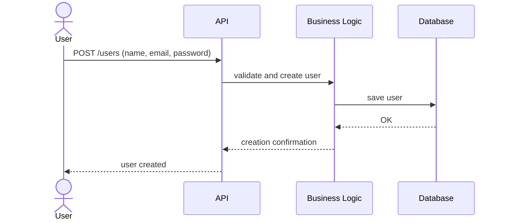
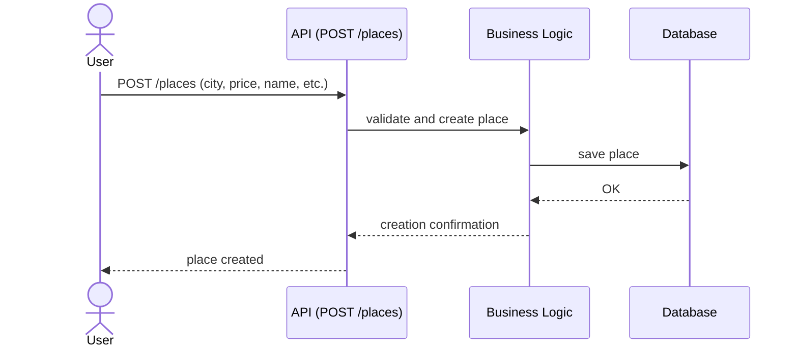
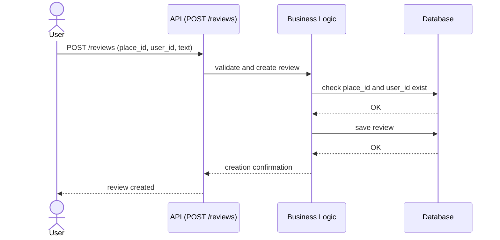
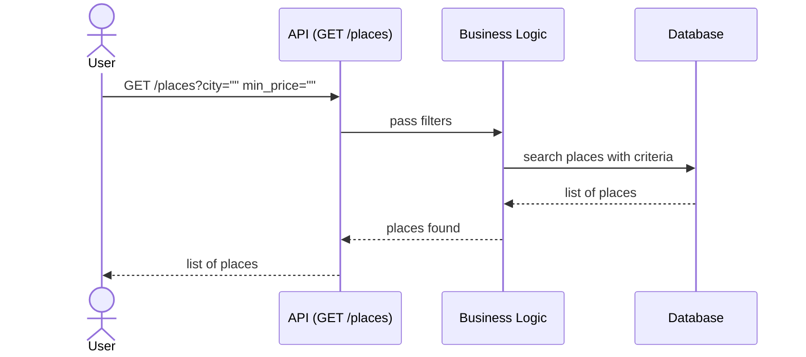

# 📦 Architecture – Sequence Diagrams Overview (Part 1 – Task 2)

## 🎯 Objectif

Ce document accompagne les diagrammes de séquence produits pour la tâche 2 de la partie 1 du projet HBnB Evolution. Il vise à expliquer les cas d’usage retenus, les choix d’architecture effectués, et la manière dont nos diagrammes reflètent l’organisation logique de l’application.

- Justifier la sélection des cas d’usage représentés.
- Montrer l’adéquation avec notre architecture 3-couches (Presentation / Business Logic / Persistence).
- Fournir un contexte de lecture aux fichiers Mermaid (`.md`) séparés.

---

## Architecture suivie

Tous les diagrammes ont été construits en cohérence avec notre architecture logicielle, structurée en trois couches :

- **Presentation Layer** : gère les requêtes API entrantes, expose les routes (ex : `/places`, `/reviews`, etc.).
- **Business Logic Layer** : contient les règles métier, la validation, les appels aux services comme `UserService`, `ReviewService`, etc.
- **Persistence Layer** : interagit directement avec la base de données via des modèles (ex : `UserModel`, `PlaceModel`, etc.).

---
## 📚 Comment lire un diagramme de séquence ?

Un **diagramme de séquence UML** sert à représenter **l’enchaînement des messages entre les composants** d’un système dans un scénario donné.

Voici les éléments clés à repérer :

| Élément | Rôle |
|--------|------|
| **Participants** (ou acteurs) | Entités qui interagissent (utilisateur, service, modèle, etc.) |
| **Flèches →** | Appels de fonction ou messages envoyés d’un acteur à un autre |
| **Flèches -->** | Réponse ou retour d’une valeur |
| **Ordre vertical** | Le temps descend : plus on va vers le bas, plus l'action est tardive |
| **Messages entre couches** | Respectent l’architecture : Presentation → Business Logic → Persistence |

---

## Cas d’usage représentés

Nous avons choisi de représenter quatre cas d’usage parmi les plus représentatifs de l’application :

### 1. Créer un utilisateur
Ce cas représente la création d’un nouvel utilisateur via le point d’entrée `/users`.  
Il illustre le passage fluide de la donnée entre les couches, de l’API à l’enregistrement final en base de données.

---

### 🧭 Lecture pas à pas :
| Etape                |Description                                       |
|----------------------|--------------------------------------------------|
| 1. POST /users (name, email, password)       | L’utilisateur remplit un formulaire avec ses informations personnelles.|
| 2. validate & create user|L’API transmet ces données à la couche métier.|
| 3. save user|La couche Business valide les données, puis demande à la base d’enregistrer le nouvel utilisateur.|
| 4. Réponse API|Une fois la création réussie, la réponse remonte jusqu’à l’utilisateur.|
---

### 2. Créer un lieu (`Place`)
Cette séquence montre le fonctionnement de la route `/places` côté création.  
Elle inclut une validation métier (vérification des champs requis) avant enregistrement dans la base de données.

---

### 🧭 Lecture pas à pas :
| Etape                |Description                                       |
|----------------------|--------------------------------------------------|
| 1. POST /places (city, price, name, etc.)|L’utilisateur envoie les informations d’un lieu à créer.|
| 2. validate and create place|L’API transmet les données à la couche métier.|
| 3. save place|La couche Business vérifie les champs, puis demande à la base d’enregistrer le lieu.|
| 4. Réponse API|Une fois la création réussie, la réponse remonte jusqu’à l’utilisateur.|
---

### 3. Créer une review
Cas d’usage un peu plus complexe : la création d’une `review` implique deux vérifications métiers :
- le lieu (`Place`) doit exister,
- l’auteur (`User`) aussi.

Cette interaction est un bon exemple de coordination entre services (`PlaceService`, `UserService`) et contrôle métier avant de persister une entité.

---

### 🧭 Lecture pas à pas :
| Etape                |Description                                       |
|----------------------|--------------------------------------------------|
| 1. POST /reviews (place_id, user_id, text)|L’utilisateur écrit une review liée à un lieu.|
| 2. validate and create review|L’API transmet les données à la couche métier.|
| 3. check place_id and user_id exist|Celle-ci vérifie que le lieu et l’auteur existent.|
| 4. save review|Si tout est correct, la review est enregistrée dans la base.|
| 5. Réponse API|Une fois la création réussie, la réponse remonte jusqu’à l’utilisateur.|
---

### 4. Lister les lieux disponibles
Ici, on observe le fonctionnement d’une route de type `GET` avec paramètres (`city`, `min_price`, etc.).  
Ce diagramme illustre l’interprétation des filtres côté Business Logic et leur transmission à la couche de Persistence.

---

### 🧭 Lecture pas à pas :
| Etape                |Description                                       |
|----------------------|--------------------------------------------------|
| 1. GET /places?city="" min_price=""|L’utilisateur effectue une recherche avec des filtres (ville, prix...).|
| 2. pass filters|L’API transmet les données à la couche métier.|
| 3. search places with criteria|Celle-ci interroge la base pour récupérer les lieux correspondants.|
| 4. Réponse API|La liste est transmise à l’utilisateur au format JSON.|
---

## Niveau de détail des diagrammes

Les diagrammes fournis sont volontairement **simples** afin de faciliter la lecture rapide, en accord avec la demande de la tâche.  
Cependant, chaque séquence peut être **déclinée dans une version plus technique**, intégrant les services et entités métiers exacts (`ReviewService`, `ReviewModel`, etc.), comme cela a été esquissé dans notre documentation technique détaillée.

---

## Organisation des fichiers

Chaque diagramme est enregistré dans un fichier dédié au format Markdown :

- `seq_diag_create_user.md`
- `seq_diag_create_place.md`
- `seq_diag_create_review.md`
- `seq_diag_list_place.md`

Ces fichiers peuvent être ouverts individuellement pour visualiser les diagrammes Mermaid associés.

---

## Conclusion

Les diagrammes de séquence produits dans cette tâche 2 posent les fondations d’une compréhension claire du fonctionnement métier de notre application.  
Ils pourront facilement être étendus et raffinés dans les parties suivantes du projet (authentification, réservation, gestion des permissions...).
