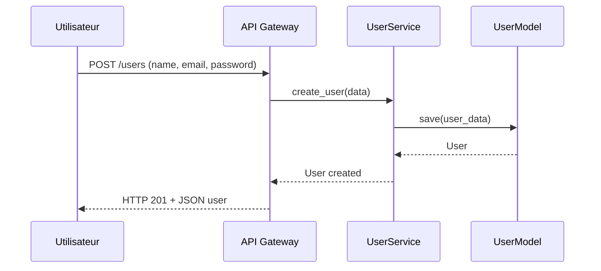
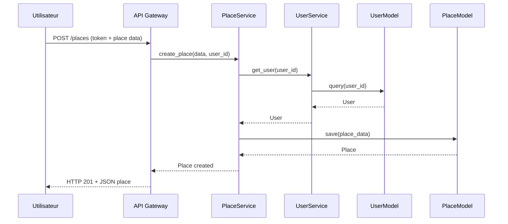
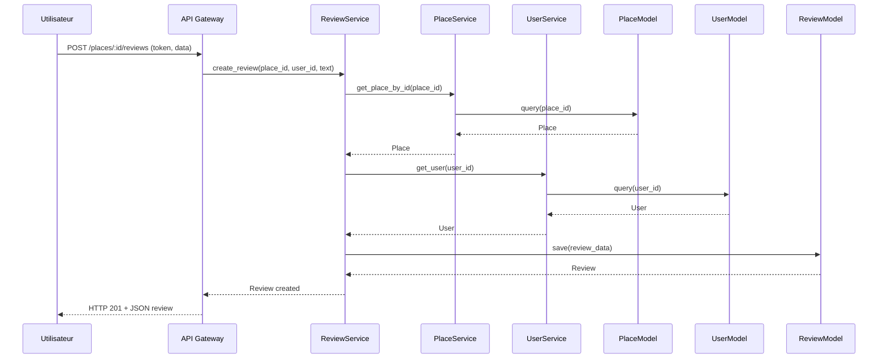
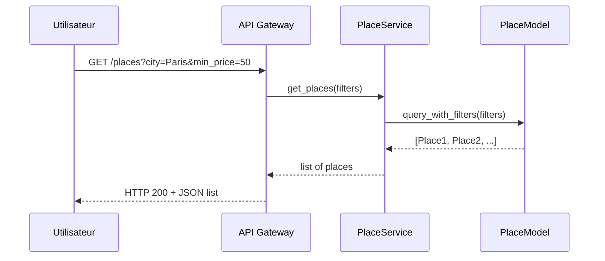

# 📦 Architecture – Detailed Sequence Diagrams (Part 1 – Task 2)

## 🧭 Introduction

Ce document présente les **versions détaillées** des diagrammes de séquence du projet HBnB.  
Ils complètent les diagrammes simplifiés fournis dans la documentation principale, en exposant de manière plus fine les **interactions internes** de l’application (services, modèles, vérifications, flux de données, etc.).

Ces diagrammes sont destinés à une lecture technique approfondie, utile pour :
- la compréhension métier,
- la maintenance du code,
- la préparation des couches API / Base de données.

Chaque cas d’usage est expliqué, suivi d’un diagramme Mermaid intégré, et d’une **lecture pas à pas commentée**.

---

## 📚 Comment lire un diagramme de séquence ?

Un **diagramme de séquence UML** sert à représenter **l’enchaînement des messages entre les composants** d’un système dans un scénario donné.

Voici les éléments clés à repérer :

| Élément | Rôle |
|--------|------|
| **Participants** (ou acteurs) | Entités qui interagissent (utilisateur, service, modèle, etc.) |
| **Flèches →** | Appels de fonction ou messages envoyés d’un acteur à un autre |
| **Flèches -->** | Réponse ou retour d’une valeur |
| **Ordre vertical** | Le temps descend : plus on va vers le bas, plus l'action est tardive |
| **Messages entre couches** | Respectent l’architecture : Presentation → Business Logic → Persistence |

---
## 🧩 Cas d’usage 1 : Créer un utilisateur

### 🎯 Objectif métier

Ce scénario correspond à l’inscription d’un nouvel utilisateur sur la plateforme HBnB.  
L’application doit :
- valider les champs requis (nom, email, mot de passe),
- vérifier l’unicité de l’email,
- et enregistrer l’utilisateur dans la base de données.

Ce cas d’usage repose sur une logique métier directe, avec peu d’étapes, ce qui en fait un bon exemple introductif pour comprendre l’architecture globale.

---

### 🖼️ Diagramme de séquence détaillé

### 🧭 Lecture pas à pas :
| Etape                |Description                                       |
|----------------------|--------------------------------------------------|
| 1. POST /users       |L’utilisateur soumet un formulaire d’inscription contenant son nom, son email et un mot de passe.|
| 2. API Gateway → UserService|L’API transfère les données à la couche métier, en appelant create_user().|
| 3. UserService → UserModel|Le service appelle la méthode de persistance save(), qui écrit l’utilisateur en base.|
| 4. Retour            |Le modèle renvoie l’utilisateur créé (ou son identifiant) au service.|
| 5. Réponse API       |L’API renvoie une réponse HTTP 201 avec un JSON représentant l’utilisateur.|

---
### 🧠 Points importants à noter
- Ce cas est linéaire : il n’y a pas de dépendance à d’autres entités (comme un place ou un review).
- Il montre le flux classique de création : données brutes → validation → persistence → retour.
- Ce même schéma sera réutilisé pour des entités comme Amenity, Place, Review…

---

## 🧩 Cas d’usage 2 : Créer un lieu

### 🎯 Objectif métier

Un utilisateur authentifié souhaite mettre en ligne un nouveau lieu (`place`) à louer sur la plateforme.  
Le système doit :
- s’assurer que l’utilisateur est valide,
- vérifier les données obligatoires (titre, prix, coordonnées, etc.),
- puis enregistrer ce lieu dans la base de données.

Ce cas est une **création directe** d’entité, avec un seul lien de dépendance (`user_id`) et des champs métiers simples.

---

### 🖼️ Diagramme de séquence détaillé

### 🧭 Lecture pas à pas :
| Etape                |Description                                       |
|----------------------|--------------------------------------------------|
| 1. POST /places|L'utilisateur envoie une requête avec un token et les données du lieu à créer.|
| 2. API → PlaceService|L’API transmet ces données à la couche métier via create_place().|
| 3. PlaceService → UserService|On vérifie que l’utilisateur est valide grâce à get_user(user_id).|
| 4. UserService → UserModel|Le service interroge la base de données (query(user_id)).|
| 5. Résultat|Le modèle retourne l’objet User.|
| 6. Enregistrement du lieu|Si l’utilisateur est valide, on appelle save(place_data) pour stocker le lieu.|
| 7. Retour du modèle|Le modèle retourne l’objet Place nouvellement créé.|
| 8. Réponse API|L’API renvoie un HTTP 201 Created avec les données du lieu au format JSON.|
---

### 🧠 Points importants à noter
- Ce cas met en avant la création d’un contenu lié à un utilisateur, sans dépendance croisée complexe.
- On réutilise la structure classique API → Service → Model, ce qui facilite l’uniformité du code.
- Cette architecture permet d'ajouter facilement :
    - un contrôle de droits (ex : admin vs host),
    - une étape de validation géographique,
    - ou une génération automatique de miniature ou d’ID unique.
---

## 🧩 Cas d’usage 3 : Créer une review

### 🎯 Objectif métier

L’utilisateur souhaite laisser un avis (`review`) sur un lieu (`place`) après y avoir séjourné.  
Le système doit :
- vérifier que le **lieu existe**,
- que l’**utilisateur est authentifié**,
- et que les **données sont valides**,
avant d’enregistrer la review dans la base de données.

Ce cas d’usage implique plusieurs **services métiers** et **vérifications croisées**. Il reflète parfaitement la logique d’une application bien structurée en couches.

---

### 🖼️ Diagramme de séquence détaillé

### 🧭 Lecture pas à pas :
| Etape                |Description                                       |
|----------------------|--------------------------------------------------|
| 1. POST /places/:id/reviews       |L'utilisateur envoie une requête HTTP avec un token d'authentification et le contenu de la review.|
| 2. API → ReviewService|L'API transmet les données à la couche métier via la méthode create_review().|
| 3. ReviewService → PlaceService|On vérifie que le lieu existe à l’aide du PlaceService.|
| 4. PlaceService → PlaceModel |Le service interroge la base pour retrouver le lieu (query(place_id)).|
| 5. Résultat du lieu |Le modèle retourne un objet Place si trouvé (ou None sinon).|
| 6. ReviewService → UserService |Si le lieu existe, on vérifie que l’utilisateur est valide via get_user(user_id).|
| 7. UserService → UserModel|Le service récupère l'utilisateur depuis la base (query(user_id)).|
| 8. Résultat de l’utilisateur|Le modèle retourne l’objet User associé à l’ID.|
| 9. Création de la review|Le ReviewService construit l’objet Review et le transmet au ReviewModel pour sauvegarde.|
| 10. Enregistrement|Le modèle écrit la review dans la base de données.|
| 11. Réponse API|L’API reçoit la confirmation, puis renvoie une réponse HTTP 201 Created avec la review au format JSON.|
---

### 🧠 Points importants à noter
- Ce diagramme montre une chaîne de validation complète avant toute création.
- Chaque couche ne fait que son rôle : pas de logique métier dans l’API, pas de requête SQL dans les services.
- Cette architecture permet de facilement ajouter :
    - un contrôle de doublon de review,
    - une vérification de date,
    - ou une modération automatique plus tard.

---
## 🧩 Cas d’usage 4 : Lister les lieux disponibles

### 🎯 Objectif métier

L’utilisateur souhaite afficher la liste des lieux (`places`) disponibles sur la plateforme.  
Il peut aussi appliquer des filtres (ville, prix minimum, capacité, etc.).

Le système doit :
- interpréter les **paramètres de recherche** dans l’URL,
- transmettre la demande à la couche métier,
- puis récupérer les lieux correspondants depuis la base de données.

Ce cas est typique des opérations de **lecture avec filtrage dynamique**, utilisées sur la page d’accueil ou dans une recherche utilisateur.

---

### 🖼️ Diagramme de séquence détaillé

### 🧭 Lecture pas à pas :
| Etape                |Description                                       |
|----------------------|--------------------------------------------------|
| 1. GET /places|L’utilisateur fait une requête HTTP, avec ou sans filtres dans l’URL (city, min_price, etc.).|
| 2. API → PlaceService|L’API transmet les filtres à la couche métier via get_places().|
| 3. PlaceService → PlaceModel|Le service applique les filtres dans une requête personnalisée (query_with_filters).|
| 4. Résultat|Le modèle retourne la liste des lieux correspondant aux critères.|
| 5. Retour service → API|Le service renvoie la liste à l’API.|
| 6. Réponse API|L’API retourne une réponse HTTP 200 avec les lieux encodés en JSON.|
---

### 🧠 Points importants à noter
- Ce cas illustre une lecture de données avec paramètres, typique des recherches utilisateurs.
- La couche métier pourrait facilement intégrer :
    - un tri (par prix, note, date),
    - une pagination (offset, limit),
    - ou un cache pour les requêtes fréquentes.
- Ce diagramme est volontairement simple mais adaptable à des recherches complexes dans les parties suivantes du projet.
---

## ✅ Conclusion

Ce document présente une analyse détaillée des principaux cas d’usage de l’application HBnB, à travers des diagrammes de séquence respectant notre architecture 3-couches (Presentation → Business Logic → Persistence).

Chaque scénario a été choisi pour sa représentativité fonctionnelle et technique :
- Création d’un utilisateur
- Création d’un lieu
- Création d’une review
- Consultation de la liste des lieux

Ces diagrammes montrent la rigueur de notre découpage en services et modèles, ainsi que notre capacité à modéliser clairement les flux de données.

Cette documentation servira de **référence technique** pour les prochaines phases du projet (API REST, persistance réelle, sécurité), mais également de **support de communication** lors des échanges avec nos formateurs ou coéquipiers si le détail de nos séquences est demandé.
