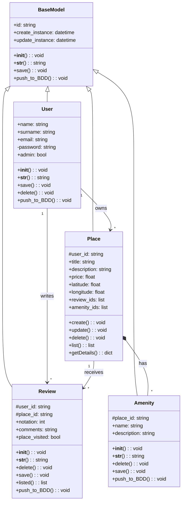

```mermaid

classDiagram

%% Inheritance
BaseModel <|-- User
BaseModel <|-- Place
BaseModel <|-- Review
BaseModel <|-- Amenity

class BaseModel {
  +id: string
  +create_instance: datetime
  +update_instance: datetime

  +__init__(): void
  +__str__(): string
  +save(): void
  +push_to_BDD(): void
}

class User {
  +name: string
  +surname: string
  +email: string
  -password: string
  +admin: bool

  +__init__(): void
  +__str__(): string
  +save(): void
  +delete(): void
  +push_to_BDD(): void
}

class Place {
  #user_id: string
  +title: string
  +description: string
  +price: float
  +latitude: float
  +longitude: float
  +review_ids: list<string>
  +amenity_ids: list<string>

  +create(): void
  +update(): void
  +delete(): void
  +list(): list<Place>
  +getDetails(): dict
}

class Review {
  #user_id: string
  #place_id: string
  +notation: int
  +comments: string
  +place_visited: bool

  +__init__(): void
  +__str__(): string
  +delete(): void
  +save(): void
  +listed(): list<Review>
  +push_to_BDD(): void
}

class Amenity {
  #place_id: string
  +name: string
  +description: string

  +__init__(): void
  +__str__(): string
  +delete(): void
  +save(): void
  +push_to_BDD(): void
}

%% Associations
User "1" --> "*" Place : owns
User "1" --> "*" Review : writes
Place "1" --> "*" Review : receives
Place "1" *-- "*" Amenity : has
```

---
