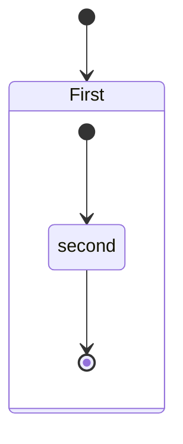

# Architecture – Entity Overview (Part 1 – Task 3)

## Objective

This document concludes **Part 1** of the HBnB project by summarizing the structure of our main entities, their business role, and how they interact within the system.

It builds upon the previous deliverables:
- the UML package diagram (Task 0),
- the UML class diagram (Task 1),
- and the sequence diagrams (Task 2).

Our goals are to:
- describe the key entities of the application,
- explain their structural relationships,
- link them to the modeled use cases,
- and anticipate their implementation in code.

---

## Main System Entities

| Entity     | Key Attributes                                       | Business Role                                                         | Usage in Use Cases                |
|------------|------------------------------------------------------|------------------------------------------------------------------------|-----------------------------------|
| BaseModel| id, create_instance, update_instance           | Parent class ensuring entity uniqueness and traceability              | Inherited by all entities         |
| User     | id, name, surname, email, password, admin| Represents a platform user (client or admin)                          | Create user, Create review, Create place |
| Place    | id, title, description, price, latitude, longitude, user_id, review_ids| Represents a place offered by a user                        | Create place, Create review, List places |
| Review   | id, user_id, place_id, text                 | Allows a user to leave feedback on a place                            | Create review                     |
| Amenity  | id, name                                         | Describes a service or feature available at a place                   | Used to filter places             |

Notes:
- Amenity appears in the class diagram but is not directly used in Part 1 use cases → It will be used in later phases.

---

## Relationships Between Entities

Our entities are logically linked as represented in the class diagram.

| Relationship                  | Type             | Technical Detail / Implementation                             |
|------------------------------|------------------|---------------------------------------------------------------|
| User → Place             | One-to-Many      | One user can create multiple places (Place.user_id)         |
| User → Review            | One-to-Many      | One user can write multiple reviews (Review.user_id)        |
| Place → Review           | One-to-Many      | One place can receive multiple reviews (Review.place_id)    |
| Place → Amenity          | Many-to-Many     | A place can have many services, and one service can be reused |
| All Entities → BaseModel   | Inheritance       | All entities inherit BaseModel (for id, timestamps, etc.) |

---

---
Notes:

- One-to-Many relationships are implemented using **foreign keys** on the “Many” side (e.g. place_id in Review).
- The Place ↔ Amenity link requires an **association table** (place_amenity).

---

## Entities and Use Cases

Here is how each entity is involved in the use cases modeled in the sequence diagrams:

| Use Case              | Entities Involved                            | Role of Entities                                                   |
|-----------------------|----------------------------------------------|---------------------------------------------------------------------|
| Create user           | User, BaseModel                          | A new user is created with a unique identifier                     |
| Create place          | Place, User, BaseModel                 | The place is linked to the creator through user_id              |
| Create review         | Review, User, Place, BaseModel       | The review is linked to both the user and the place (must exist)  |
| List places           | Place                                     | The system retrieves places, optionally filtered by Amenity    |

---

Notes:

- These use cases cover the **main system interactions**: creation, relationships, and conditional data retrieval.

---

## Projection Into Code

Our entities will be implemented as **Python classes**, following a standard object-oriented design.

### Shared Structure (Inheritance)

All entities (User, Place, Review, Amenity) will inherit from a **common BaseModel class**, which will provide:

- a unique ID (id)
- a creation timestamp (create_instance)
- an update timestamp (update_instance)
- common methods such as:
  - __init__() – initialization
  - __str__() – string representation
  - save() – updates update_instance

This allows us to **centralize shared behaviors** and **facilitate future extensions** (serialization, persistence, etc.).

---

### Implementation Examples (Pseudocode Only)

| Class     | Specific Attributes                                      | Expected Methods                      |
|-----------|----------------------------------------------------------|----------------------------------------|
| User    | name, surname, email, password, admin          | delete(), save(), __str__()      |
| Place   | title, description, price, latitude, longitude, user_id, review_ids, amenities | save(), get_reviews() |
| Review  | user_id, place_id, text                            | save()                               |
| Amenity | name                                                   | save()                               |

---

Notes:

- Attributes like user_id, place_id, and review_ids represent **entity relationships**.
- Some attributes (amenity) may be **lists of objects or IDs**.
- The implementation will follow **object-oriented best practices**, separating **data (attributes)** from **behavior (methods)**.

---

## Conclusion

This document summarizes our understanding of the object-oriented architecture of the HBnB application.

It highlights:
- the **main entities** used in the system,
- their **structural and functional relationships**,
- their **specific roles within business use cases**,
- and their **technical projection** into Python classes.

This conceptual work sets a solid foundation for future implementation: class definitions, data serialization, API routing, and persistence management.
