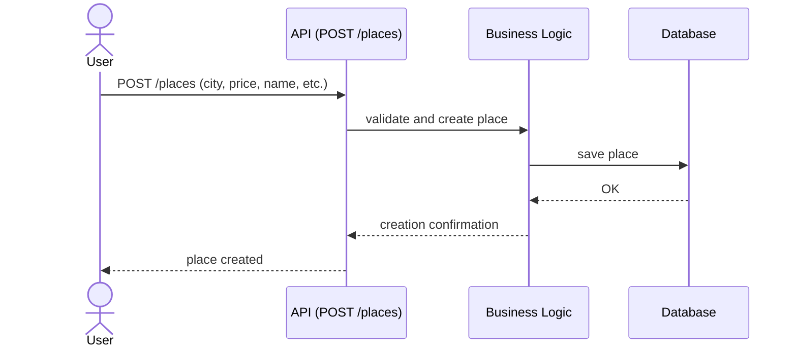

```mermaid

sequenceDiagram
    actor User
    participant API as API (POST /places)
    participant Business as Business Logic
    participant DB as Database

    User->>API: POST /places (city, price, name, etc.)
    API->>Business: validate and create place
    Business->>DB: save place
    DB-->>Business: OK
    Business-->>API: creation confirmation
    API-->>User: place created
```

---
