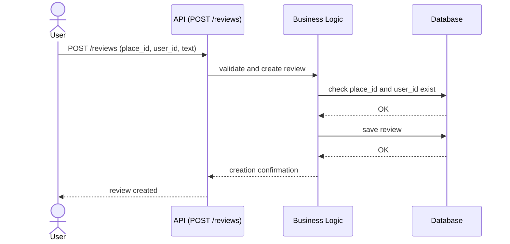

```mermaid

sequenceDiagram
    actor User
    participant API as API (POST /reviews)
    participant Business as Business Logic
    participant DB as Database

    User->>API: POST /reviews (place_id, user_id, text)
    API->>Business: validate and create review
    Business->>DB: check place_id and user_id exist
    DB-->>Business: OK
    Business->>DB: save review
    DB-->>Business: OK
    Business-->>API: creation confirmation
    API-->>User: review created
```

---
