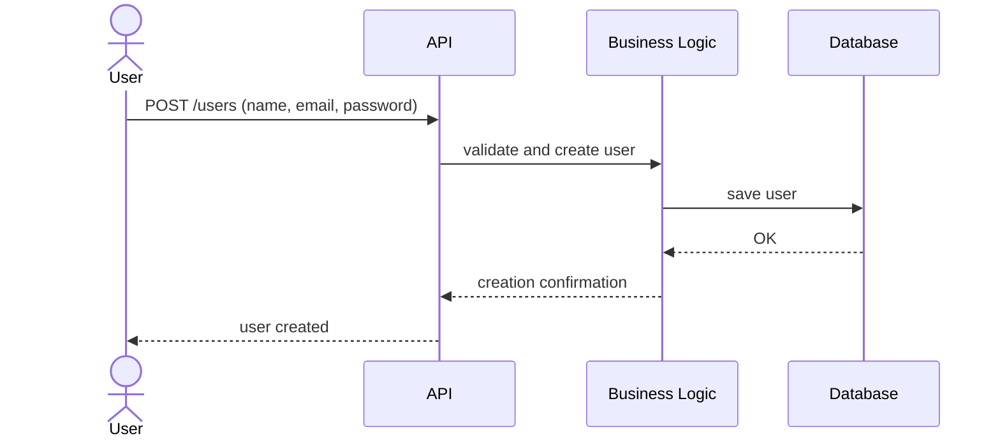

```mermaid

sequenceDiagram
    actor User
    participant API as API
    participant Business as Business Logic
    participant DB as Database

    User->>API: POST /users (name, email, password)
    API->>Business: validate and create user
    Business->>DB: save user
    DB-->>Business: OK
    Business-->>API: creation confirmation
    API-->>User: user created
```

---
