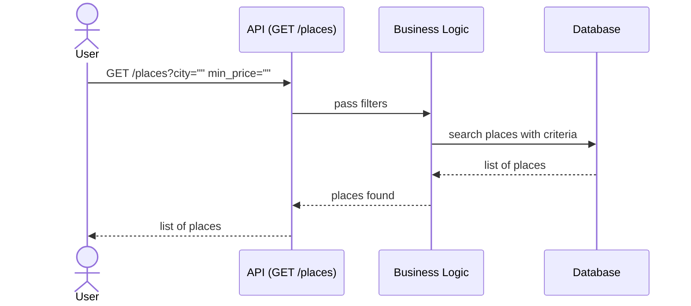

```mermaid

sequenceDiagram
    actor User
    participant API as API (GET /places)
    participant Business as Business Logic
    participant DB as Database

    User->>API: GET /places?city="" min_price=""
    API->>Business: pass filters
    Business->>DB: search places with criteria
    DB-->>Business: list of places
    Business-->>API: places found
    API-->>User: list of places
```

---
