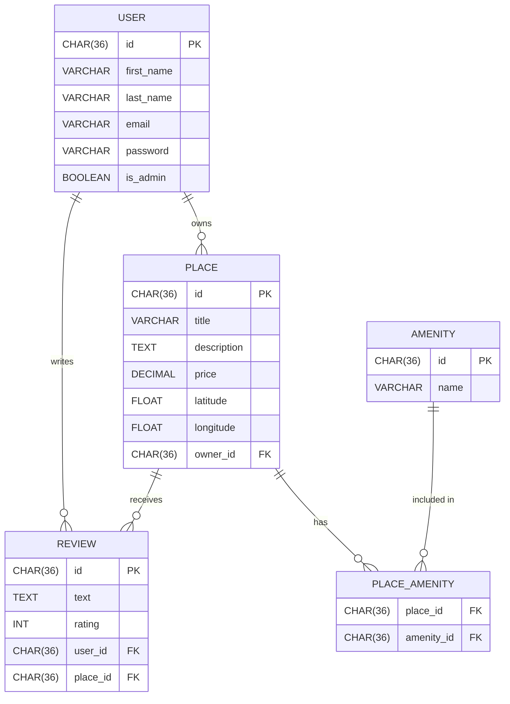

# HBnB - Part 3: Authentication & Database Integration

This is Part 3 of the HBnB project, which introduces user authentication and database integration. It replaces in-memory storage with SQLAlchemy ORM using SQLite (for development) and MySQL (for production), and adds secure user login via JWT.

## 🎯 Objectives – Part 3

The main goals of Part 3 of the HBnB project are:

- ✅ **Persist data** using a relational database instead of in-memory storage.
- ✅ **Introduce user authentication** using JWT (JSON Web Tokens) with `Flask-JWT-Extended`.
- ✅ **Enforce password security** with hashing via `Flask-Bcrypt`.
- ✅ **Implement role-based access control** to distinguish between admin and regular users.
- ✅ **Structure the application** using best practices: blueprints, services, persistence layers, and modular config.
- ✅ **Support CRUD operations** for all core models (User, Place, Review, Amenity) with database backing.
- ✅ **Visualize database relationships** using `Mermaid.js` entity-relationship diagrams.
- ✅ **Prepare the app for deployment** by supporting both SQLite (dev) and MySQL (prod).

This part lays the foundation for a scalable, secure backend using modern Flask architecture and relational persistence.

## 📌 Features

- JWT-based authentication (`Flask-JWT-Extended`)
- Role-based access control (admin vs. regular users)
- Password hashing (`Flask-Bcrypt`)
- SQLAlchemy integration (SQLite & MySQL)
- CRUD operations backed by a relational database
- Relationships between models (Users, Places, Reviews, Amenities)
- Mermaid.js diagrams to visualize database structure

## 🗂️ Project Structure

```
<pre>

part3/
├── README.md              # Project documentation
├── Sql/                   # SQL scripts (schema, migrations)
├── config.py              # Flask configuration
├── doc/                   # Documentation resources
├── instance/              # Instance-specific configs
├── requirements.txt       # Project dependencies
├── run.py                 # App entry point
├── tests/                 # Unit & integration tests
├── venv/                  # Virtual environment
└── app/                   # Main application package
    ├── __init__.py        # App factory
    ├── extensions.py      # JWT, DB, Bcrypt extensions
    ├── api/               # Flask routes (blueprints)
    ├── models/            # ORM models
    ├── persistence/       # DB sessions, repositories
    ├── services/          # Business logic
    └── utils/             # Helper functions

</pre>
```

## 🛠️ Installation && Running

### 1. Clone the repository

```bash
git clone https://github.com/Helvlaska/holbertonschool-hbnb.git
```

### 2. Create a virtual environment

```bash
python3 -m venv venv
source venv/bin/activate
```

### 3. Install dependencies

```bash
pip install -r requirements.txt
```

### 4.  Start the application

```bash
python run.py
```

By default, the app will be available at:

```
http://127.0.0.1:5000/
```

## ⚙️ Usage

Run the App

---

### Set environment (development or production)

export FLASK_ENV=development
export FLASK_APP=run.py

### Run the server

```bash

flask run.py
```

## 🛠 Configuration

The config.py file includes configuration classes:

Config: Base configuration

DevelopmentConfig: Debug mode enabled by default

You can set the SECRET_KEY environment variable to secure your application.

## 🔧 Dependencies

The requirements.txt file includes:

```

flask
flask-restx
```

## 🚧 Project Status

✅ Project structure in place

✅ Functional in-memory repository

✅ Facade instantiated

✅ API routes implemented in Part 3

✅ Database integration completed in Part 3

🕓 Front-end development planned for Part 4

🕓 Further testing and documentation enhancements pending

## 🧪 Technologies

- Python 3
- Flask
- SQLAlchemy
- Flask-JWT-Extended
- Flask-Bcrypt
- SQLite / MySQL
- Mermaid.js (for ER diagrams)

## 🧪 Testing SQL Scripts

To verify and test your SQL scripts (e.g., schema creation, table relationships), you can use either SQLite (dev) or MySQL (prod).

### ▶️ Using SQLite (Dev)

```bash
# Launch SQLite with a test database
sqlite3 test.db

# Inside SQLite shell, run your script:
.read Sql/schema.sql

# Check tables created
.tables

# Exit SQLite shell
.quit

# Optional: Delete test DB after test
rm test.db
```

### ▶️ Using MySQL (Prod-like)

```bash
# Log into MySQL (replace with your actual credentials)

mysql -u root -p

# Inside MySQL shell, create and use test database:

CREATE DATABASE hbnb_test;
USE hbnb_test;

# Source your script

SOURCE Sql/schema.sql;

# Check tables

SHOW TABLES;

# Exit

EXIT;
```



## ✅ Admin Access

- Admins can:

- Create or modify users

- Add/edit amenities

- Bypass ownership restrictions

- Set is_admin=True for a user in the database or via a migration script.

## 📄 License

Educational project — Holberton School.

## 👥 Author

Claire Castan Anne-Cécile Colléter
